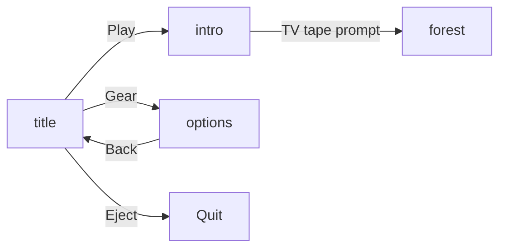

# N / E / S — Project Structure

A modern retro 2D game built with [LÖVE](https://love2d.org/) (Love2D) and Lua. The project draws inspiration from the found-footage horror aesthetic of *V/H/S*.

---

## Quick Reference

| Item | Value |
|------|-------|
| Engine | LÖVE 11.x |
| Language | Lua 5.1 |
| Window title | `N / E / S` |
| Virtual resolution | 640 × 360 |
| Window resolution | 1280 × 720 (resizable) |
| Entry point | `main.lua` |
| Test runner | `run_tests.lua` |

---

## Directory Tree

```text
N-E-S/
├── assets/                 # Game media (audio, fonts, sprites, maps, UI)
│   ├── audio/
│   │   ├── music/          # Background music (OGG streams)
│   │   └── sfx/            # Sound effects (WAV/OGG)
│   ├── fonts/              # TTF fonts and license sidecar files
│   ├── sprites/            # Character and enemy sprite sheets
│   │   ├── characters/     # player/, wendy/
│   │   └── enemies/        # glitch_monster.png
│   ├── ui/                 # Menu, HUD, and icon assets
│   │   ├── menu/           # Title and options buttons
│   │   ├── hud/            # Dialogue box, prompts
│   │   └── icons/          # D-pad icons for options screen
│   └── worlds/             # Tiled map exports (.tmx source + .lua runtime)
│       ├── intro_room/     # Intro room level
│       └── forest_glitch/  # Forest Glitch tape level
├── docs/                   # Project documentation
├── entities/               # Controllable and NPC game objects
├── lib/                    # Third-party and utility libraries
│   ├── moonshine/          # Post-processing shader effects (vrld/moonshine)
│   └── sti/                # Simple Tiled Implementation (map loader)
├── states/                 # Game state modules (screens / levels)
├── tests/                  # LuaUnit test suites
├── ui/                     # Shared UI components
├── conf.lua                # LÖVE engine configuration
├── config.lua              # Input bindings (Baton)
├── constants.lua           # Screen dimensions and shared constants
├── main.lua                # Engine lifecycle hooks and state router
├── run_tests.lua           # Headless test runner (no LÖVE required)
└── README.md               # Project overview
```

---

## Architecture Overview

The game uses a **state machine** pattern. `main.lua` owns a global `State` table and dispatches LÖVE callbacks (`update`, `draw`, `keypressed`, `gamepadpressed`) to whichever module is active in `State.GameState`.



Rendering uses **push** for pixel-perfect scaling from a 640×360 virtual canvas to the physical window. All graphics use nearest-neighbor filtering for a crisp retro look.

Collision and map loading combine **Simple Tiled Implementation (STI)** with **bump.lua** for axis-aligned bounding-box physics.

Input is centralized in `config.lua` via **Baton**, supporting keyboard and gamepad with remappable bindings exposed in the options screen.

---

## Root Files

| File | Purpose |
|------|---------|
| `main.lua` | Initializes audio, fonts, push viewport, and all states. Routes LÖVE events to the active state. Defines global `State` (game state name, fonts, audio handles, options selection). |
| `conf.lua` | Sets window title, default size (1280×720), and resizable flag before LÖVE starts. |
| `constants.lua` | Virtual and window dimensions; shared layout values. |
| `config.lua` | Baton input manager: movement, action, jump controls plus metadata for the options UI. |
| `run_tests.lua` | Discovers `tests/test_*.lua` files and runs them with LuaUnit (pure Lua, no LÖVE runtime). |

---

## States (`states/`)

Each state is a Lua module returning a table with optional lifecycle hooks: `load`, `update`, `draw`, `keypressed`, `gamepadpressed`.

| Module | Key | Description |
|--------|-----|-------------|
| `title.lua` | `title` | Main menu with Play, Options, and Quit buttons. Horizontal navigation with wrap-around selection. |
| `options.lua` | `options` | Input remapping screen. Lists all Baton controls; supports live rebind and back navigation. |
| `intro.lua` | `intro` | Intro room level. Opens with wake-up dialogue and lying-down animation, then enables player movement. Interacting with the TV transitions to the forest state. |
| `forest.lua` | `forest` | Forest Glitch level. Loads the forest Tiled map and spawns Wendy as the player character. |

### State flow

1. **Title** — Default entry state. Play → Intro; Gear → Options; Eject → quit.
2. **Intro** — Dialogue-driven opening. After exploring, the player can interact with a TV object to start the "Forest Glitch" tape.
3. **Forest** — Second playable level; Wendy replaces the main character.
4. **Options** — Accessible from title; returns via the Rewind back button or Escape.

---

## Entities (`entities/`)

Reusable game objects with `load`, `update`, and `draw` methods. Both use **anim8** for sprite-sheet animation and **bump** for collision when a world is provided.

| Module | Role |
|--------|------|
| `player.lua` | Main character used in the intro room. Directional idle/run animations from separate sprite sheets under `assets/sprites/characters/player/`. |
| `wendy.lua` | Playable character in the forest level. Single combined sprite sheet at `assets/sprites/characters/wendy/wendy.png` (16×16 frames, 4 directions). |

Shared behavior: movement via Baton `move` vector, bump world collision, direction-based animation state machine (`idle_*` / `run_*`).

---

## UI (`ui/`)

| Module | Purpose |
|--------|---------|
| `dialogue.lua` | Typewriter-style dialogue banner. States: `inactive`, `typing`, `finished`. Used in intro for opening monologue and TV interaction prompt. |

Assets: `assets/ui/hud/dialog_box.png` (box), `assets/ui/hud/dialog_arrow.png` (advance prompt), `assets/fonts/KindlyRewind-BOon.ttf` (dialogue font).

---

## Assets (`assets/`)

### Audio

| Path | Usage |
|------|-------|
| `audio/music/intro.ogg` | Title/background music (loaded in `main.lua`, currently not auto-playing during debug) |
| `audio/sfx/select.wav` | Confirm / select sound |
| `audio/sfx/nav.ogg` | Menu navigation sound |
| `audio/sfx/static_1.wav` | Static effect (reserved) |

### Fonts

| File | Usage |
|------|-------|
| `RasterForgeRegular-JpBgm.ttf` | Main UI font (`State.RF_Font`, size 100, scaled down in menus) |
| `KindlyRewind-BOon.ttf` | Dialogue text |

License info is stored in sidecar files matching each TTF name (e.g. `RasterForgeRegular-JpBgm.txt`).

### Sprites (`assets/sprites/`)

| Folder | Contents |
|--------|----------|
| `characters/player/` | Player idle/run sheets (4 directions) plus `lying_down.png` for intro wake-up |
| `characters/wendy/` | `wendy.png` — playable character in forest level |
| `enemies/` | `glitch_monster.png` (unused asset) |

### UI (`assets/ui/`)

| Subfolder | Contents |
|-----------|----------|
| `menu/` | `play_btn`, `gear_btn`, `eject_btn`, `btn_rewind` |
| `hud/` | `dialog_box`, `dialog_arrow`, `action_prompt` |
| `icons/` | `dpad_up`, `dpad_down`, `dpad_left`, `dpad_right` |

### Worlds (`assets/worlds/`)

Each level folder contains:

- **`.tmx`** — Tiled map source (edit in [Tiled Map Editor](https://www.mapeditor.org/))
- **`.lua`** — STI-exported runtime map (loaded by game code)
- **Tileset PNGs** — Referenced by the map

| Level | Map file | Notable layers / objects |
|-------|----------|--------------------------|
| `intro_room/` | `intro_room` | Collidable layer (hidden at runtime); TV object with `properties.type = "tv"` |
| `forest_glitch/` | `forest` | Spawns layer with `wendy_spawn` object for player placement |

---

## Libraries (`lib/`)

### Game-critical

| Library | File(s) | Role |
|---------|---------|------|
| **push** | `push.lua` | Virtual resolution scaling and letterboxing |
| **anim8** | `anim8.lua` | Sprite-sheet animation grids and playback |
| **baton** | `baton.lua` | Unified keyboard/gamepad input with remapping |
| **bump** | `bump.lua` | 2D AABB collision world |
| **STI** | `sti/` | Loads Tiled `.lua` exports; `plugins/bump.lua` integrates collision |
| **luaunit** | `luaunit.lua` | Unit test framework for `run_tests.lua` |

### Utilities

| Library | File | Role |
|---------|------|------|
| **sprite_generator** | `sprite_generator.lua` | Procedural pixel-art generation from ASCII grids and a color palette (e.g. CRT TV tiles) |

### Bundled but not yet wired in

| Library | Location | Notes |
|---------|----------|-------|
| **moonshine** | `lib/moonshine/` | Chainable post-processing shaders (CRT, scanlines, film grain, vignette, etc.). Present in repo; not yet required from `main.lua`. |

STI also ships optional plugins for Box2D (`sti/plugins/box2d.lua`) — not used by current game code.

---

## Tests (`tests/`)

Tests run outside LÖVE via:

```bash
lua run_tests.lua
```

| Test file | Covers |
|-----------|--------|
| `test_title.lua` | Title menu selection wrap-around logic (`getNewSelection`) |
| `test_options.lua` | Options menu vertical navigation logic |
| `test_dialogue.lua` | Dialogue state machine: typing, skip, dismiss, character advance |

Tests focus on pure logic extracted into testable functions; LÖVE-specific code paths are guarded with `if not love` checks in options/dialogue where needed.

---

## Global State

`main.lua` exposes a global `State` table:

```lua
State = {
    GameState = "title",           -- Active state key
    CurrentOptionsSelection = 1,   -- Options menu cursor
    RF_Font = nil,                 -- RasterForge title font
    BGM = nil,                     -- Background music source
    SFX_Select = nil,              -- Confirm sound
    SFX_Nav = nil                  -- Navigation sound
}
```

States read and mutate `State.GameState` to transition between screens.

---

## Input Scheme

Default bindings (defined in `config.lua`):

| Action | Keyboard | Gamepad |
|--------|----------|---------|
| Move | WASD / Arrow keys | Left stick / D-pad |
| Action | Z / Left Shift | X |
| Jump | X / Space | A |

Title screen uses its own hardcoded key/gamepad handlers. Intro and gameplay states use Baton via `config.lua`. A TODO in `main.lua` notes a future refactor to use Baton globally.

---

## Development Notes

- **Pixel art**: Nearest-neighbor filtering is set globally and per-image.
- **Maps**: Edit `.tmx` in Tiled, export to `.lua` for STI. Re-export after tile or layer changes.
- **New states**: Add a module under `states/`, register it in `main.lua`'s `states` table, call `.load()` in `love.load()`, and transition via `State.GameState`.
- **New entities**: Follow the `player.lua` / `wendy.lua` pattern: `load(x, y, world)`, `update(dt)`, `draw()`.
- **Post-processing**: To enable moonshine, require `lib.moonshine` in `main.lua` and wrap `push:finish()` draw calls per the moonshine README.

### Asset naming conventions

- **snake_case** for all folders and asset filenames
- **Organize by role**: `sprites/characters/`, `sprites/enemies/`, `ui/menu|hud|icons/`, `worlds/<map_name>/`
- **World folders match map basename** (`intro_room`, `forest_glitch`)
- **Tilesets stay co-located** with their Tiled map in the same world folder
- **Keep original TTF filenames**; pair license info as `<FontFileName>.txt`
- **New characters** go in `assets/sprites/characters/<name>/`, not under level folders

---

## Dependency Summary

```text
main.lua
├── lib.push
├── constants
└── states.*
    ├── title        (constants)
    ├── options      (constants, config/baton)
    ├── intro        (anim8, sti, bump, player, ui.dialogue, config)
    └── forest       (sti, bump, wendy, config)

entities.*
├── anim8
└── config (baton)

config.lua → lib.baton
```

---

## Related Documentation

- [README.md](../README.md) — Project overview and high-level structure
