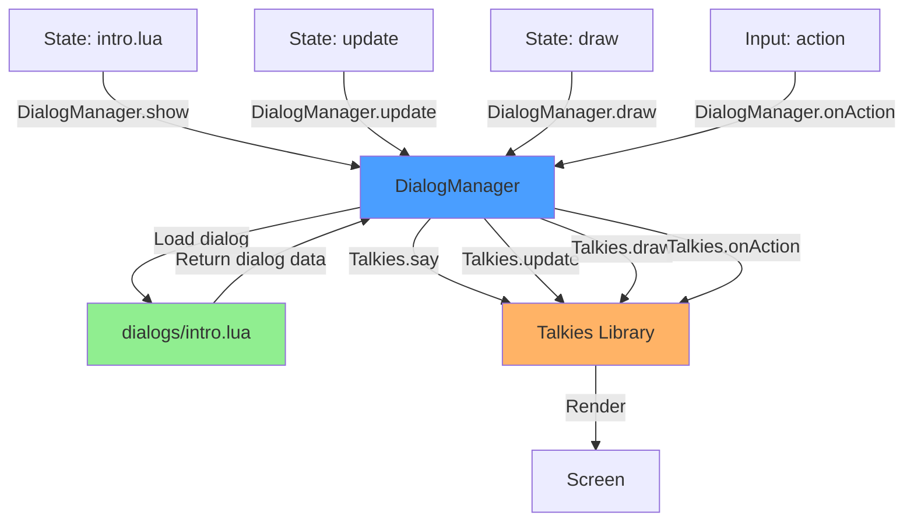

# Dialog System Architecture Plan

## Current State Analysis

### Problem
Dialog content is currently hardcoded directly in [`states/intro.lua`](../states/intro.lua:97):
```lua
Talkies.say("System", "Talkies integration successful! Press action to continue.")
```

This approach has several issues:
- **Maintainability**: Dialog text scattered across state files
- **Localization**: No easy way to translate text
- **Reusability**: Can't share dialog logic between states
- **Content Management**: Writers can't edit dialog without touching code
- **Testing**: Hard to test dialog flows independently

## Proposed Architecture

### Option 1: Centralized Dialog Module (Recommended)

Create a dedicated dialog management system that separates content from logic.

#### Structure
```
dialogs/
├── init.lua              # Dialog manager module
├── intro.lua             # Intro stage dialogs
├── forest.lua            # Forest stage dialogs
├── npcs/
│   ├── wendy.lua         # Wendy's dialog trees
│   └── system.lua        # System messages
└── config.lua            # Shared dialog configuration
```

#### Benefits
- ✓ Centralized content management
- ✓ Easy to find and edit dialog
- ✓ Reusable dialog logic
- ✓ Supports dialog trees and branching
- ✓ Can be extended for localization
- ✓ Clear separation of concerns

#### Implementation Pattern

**dialogs/init.lua** - Dialog Manager
```lua
local Talkies = require("lib.talkies")
local game = require("game")

local DialogManager = {
    font = nil,
    initialized = false
}

-- Initialize dialog system (call once in game.lua or main.lua)
function DialogManager.init()
    if DialogManager.initialized then return end
    
    DialogManager.font = love.graphics.newFont("assets/fonts/RasterForgeRegular-JpBgm.ttf", 16)
    DialogManager.font:setFilter("nearest", "nearest")
    
    -- Global Talkies configuration
    Talkies.font = DialogManager.font
    Talkies.textSpeed = "medium"
    Talkies.messageColor = {1, 1, 1}
    Talkies.messageBackgroundColor = {0, 0, 0, 0.8}
    Talkies.padding = 10
    
    DialogManager.initialized = true
end

-- Show a dialog by ID
function DialogManager.show(dialogId, context)
    local dialog = DialogManager.get(dialogId)
    if not dialog then
        print("Warning: Dialog not found: " .. dialogId)
        return
    end
    
    -- Support for dynamic text (context substitution)
    local text = dialog.text
    if type(text) == "function" then
        text = text(context)
    end
    
    Talkies.say(dialog.speaker, text, dialog.config or {})
end

-- Get dialog by ID (implemented by loading dialog modules)
function DialogManager.get(dialogId)
    -- Parse ID format: "module.dialogKey" (e.g., "intro.wakeup")
    local module, key = dialogId:match("([^.]+)%.(.+)")
    if not module then return nil end
    
    local dialogModule = require("dialogs." .. module)
    return dialogModule[key]
end

-- Update and draw (convenience wrappers)
function DialogManager.update(dt)
    Talkies.update(dt)
end

function DialogManager.draw()
    Talkies.draw()
end

function DialogManager.isOpen()
    return Talkies.isOpen()
end

function DialogManager.onAction()
    Talkies.onAction()
end

function DialogManager.clear()
    Talkies.clearMessages()
end

return DialogManager
```

**dialogs/intro.lua** - Intro Stage Dialogs
```lua
return {
    wakeup = {
        speaker = "System",
        text = "Talkies integration successful! Press action to continue."
    },
    
    tv_prompt = {
        speaker = "System",
        text = "The TV flickers with static. Something draws you closer...",
        config = {
            oncomplete = function()
                -- Optional callback after dialog closes
            end
        }
    },
    
    tv_interaction = {
        speaker = "???",
        text = {
            "The screen pulses with an otherworldly glow.",
            "Do you dare to enter?"
        },
        config = {
            options = {
                {"Enter", function() 
                    local Gamestate = require("lib.hump.gamestate")
                    Gamestate.switch(require("states.forest"))
                end},
                {"Not yet", function() end}
            }
        }
    }
}
```

**dialogs/npcs/wendy.lua** - NPC Dialog Trees
```lua
return {
    first_meeting = {
        speaker = "Wendy",
        text = {
            "Oh! You startled me.",
            "I haven't seen another person here in... how long has it been?",
            "Welcome to the glitch forest."
        }
    },
    
    greeting = {
        speaker = "Wendy",
        text = "Hello again! Still exploring?"
    },
    
    quest_start = {
        speaker = "Wendy",
        text = "I need your help finding something...",
        config = {
            options = {
                {"What is it?", function()
                    local DialogManager = require("dialogs.init")
                    DialogManager.show("npcs.wendy.quest_explain")
                end},
                {"Maybe later", function() end}
            }
        }
    },
    
    quest_explain = {
        speaker = "Wendy",
        text = {
            "There's a corrupted data fragment deeper in the forest.",
            "It's causing the glitches to spread.",
            "Can you help me retrieve it?"
        }
    }
}
```

**dialogs/config.lua** - Shared Configuration
```lua
return {
    -- Character portraits
    portraits = {
        system = nil,
        wendy = "assets/sprites/characters/wendy/portrait.png",
        player = "assets/sprites/characters/player/portrait.png"
    },
    
    -- Sound effects
    sounds = {
        talk = "assets/audio/sfx/talk.wav",
        select = "assets/audio/sfx/select.wav"
    },
    
    -- Text speed presets
    speeds = {
        slow = 0.08,
        medium = 0.04,
        fast = 0.01,
        instant = 0
    }
}
```

#### Usage in States

**Modified states/intro.lua**
```lua
local DialogManager = require("dialogs.init")

function Intro:enter()
    -- ... existing setup ...
    DialogManager.init()  -- Initialize once
end

function Intro:update(dt)
    input:update()
    DialogManager.update(dt)
    
    if isLyingDown then
        lyingAnim:update(dt)
        if lyingAnim.status == "paused" then
            isLyingDown = false
            if not dialogShown then
                DialogManager.show("intro.wakeup")  -- Use dialog ID
                dialogShown = true
            end
        end
    else
        if DialogManager.isOpen() then
            if input:pressed("action") or input:pressed("jump") then
                DialogManager.onAction()
            end
        else
            player:update(dt)
            promptAnim:update(dt)
            
            if nearTv() and (input:pressed("action") or input:pressed("jump")) then
                DialogManager.show("intro.tv_interaction")  -- Show dialog with options
            end
        end
    end
end

function Intro:draw()
    -- ... existing drawing ...
    DialogManager.draw()
end

function Intro:leave()
    DialogManager.clear()
end
```

---

### Option 2: Data-Driven JSON/Lua Files

Store dialog content in separate data files that can be edited by non-programmers.

#### Structure
```
assets/
└── dialogs/
    ├── intro.lua         # Lua table format
    ├── forest.lua
    └── npcs/
        └── wendy.lua
```

#### Benefits
- ✓ Content separated from code
- ✓ Easy for writers to edit
- ✓ Could use JSON for better tooling
- ✓ Simple to implement

#### Drawbacks
- ✗ Less flexible for complex logic
- ✗ Callbacks harder to implement
- ✗ No code completion for dialog IDs

---

### Option 3: Hybrid Approach (Best of Both Worlds)

Combine centralized module with data files for pure content.

#### Structure
```
dialogs/
├── init.lua              # Dialog manager
└── data/
    ├── intro.lua         # Pure data (text only)
    ├── forest.lua
    └── npcs/
        └── wendy.lua

dialogs/
├── init.lua              # Dialog manager
└── scripts/
    ├── intro.lua         # Logic + callbacks
    └── npcs/
        └── wendy.lua
```

#### Benefits
- ✓ Simple dialogs in data files
- ✓ Complex dialogs with logic in scripts
- ✓ Best flexibility

---

## Recommended Implementation Plan

### Phase 1: Create Dialog Manager Module
1. Create `dialogs/init.lua` with core DialogManager
2. Move Talkies configuration from states to DialogManager
3. Add convenience methods (show, update, draw, etc.)

### Phase 2: Extract Intro Dialogs
1. Create `dialogs/intro.lua` with intro stage dialogs
2. Refactor `states/intro.lua` to use DialogManager
3. Test that existing dialog still works

### Phase 3: Enhance with Features
1. Add portrait support
2. Add sound effects
3. Create dialog for TV interaction with options
4. Add context/variable substitution

### Phase 4: Expand to Other States
1. Create `dialogs/forest.lua`
2. Create `dialogs/npcs/wendy.lua`
3. Integrate into `states/forest.lua`

### Phase 5: Advanced Features (Optional)
1. Dialog state tracking (which dialogs have been seen)
2. Conditional dialogs (show different text based on game state)
3. Localization support
4. Dialog editor tool

---

## Integration with game.lua

Since [`game.lua`](../game.lua) is the shared context module, consider adding dialog system there:

```lua
local game = {
    font  = nil,
    audio = {
        bgm       = nil,
        sfxSelect = nil,
        sfxNav    = nil,
    },
    dialog = nil  -- Add dialog manager reference
}

-- In main.lua love.load():
game.dialog = require("dialogs.init")
game.dialog.init()

return game
```

This makes the dialog system globally accessible like audio and fonts.

---

## File Organization Comparison

### Current (Hardcoded)
```
states/intro.lua: 146 lines
  - State logic: ~120 lines
  - Dialog content: ~1 line (hardcoded)
  - Dialog logic: ~25 lines (mixed with state)
```

### Proposed (Modular)
```
dialogs/init.lua: ~80 lines (reusable)
dialogs/intro.lua: ~30 lines (pure content)
states/intro.lua: ~130 lines
  - State logic: ~120 lines
  - Dialog calls: ~10 lines (clean API)
```

---

## Example: Complex Dialog Tree

**dialogs/npcs/wendy.lua**
```lua
local DialogManager = require("dialogs.init")

return {
    -- Track conversation state
    state = {
        metBefore = false,
        questAccepted = false,
        questComplete = false
    },
    
    -- Dynamic greeting based on state
    greeting = {
        speaker = "Wendy",
        text = function(context)
            local state = context.state or {}
            if not state.metBefore then
                state.metBefore = true
                return "Oh! You startled me. I'm Wendy."
            elseif state.questComplete then
                return "Thank you for your help!"
            elseif state.questAccepted then
                return "Any luck finding that fragment?"
            else
                return "Hello again!"
            end
        end
    },
    
    -- Branching conversation
    conversation = {
        speaker = "Wendy",
        text = "What brings you to the glitch forest?",
        config = {
            options = {
                {"Just exploring", function()
                    DialogManager.show("npcs.wendy.response_exploring")
                end},
                {"Looking for answers", function()
                    DialogManager.show("npcs.wendy.response_answers")
                end},
                {"I'm lost", function()
                    DialogManager.show("npcs.wendy.response_lost")
                end}
            }
        }
    }
}
```

---

## Migration Strategy

### Step 1: Non-Breaking Addition
- Create dialog system alongside existing code
- Don't modify working states initially
- Test dialog system in isolation

### Step 2: Gradual Migration
- Migrate intro.lua first (already has dialog)
- Keep old code commented out for reference
- Test thoroughly

### Step 3: Expand Usage
- Add dialogs to forest.lua
- Create NPC dialog trees
- Add TV interaction dialog

### Step 4: Cleanup
- Remove old hardcoded dialogs
- Update documentation
- Create dialog authoring guide

---

## Mermaid Diagram: Dialog System Flow



---

## Comparison Table

| Aspect | Current (Hardcoded) | Option 1 (Module) | Option 2 (Data Files) | Option 3 (Hybrid) |
|--------|---------------------|-------------------|----------------------|-------------------|
| Maintainability | ⭐ | ⭐⭐⭐⭐⭐ | ⭐⭐⭐⭐ | ⭐⭐⭐⭐⭐ |
| Flexibility | ⭐⭐ | ⭐⭐⭐⭐⭐ | ⭐⭐⭐ | ⭐⭐⭐⭐⭐ |
| Writer-Friendly | ⭐ | ⭐⭐⭐ | ⭐⭐⭐⭐⭐ | ⭐⭐⭐⭐ |
| Localization | ⭐ | ⭐⭐⭐⭐ | ⭐⭐⭐⭐⭐ | ⭐⭐⭐⭐⭐ |
| Code Reuse | ⭐ | ⭐⭐⭐⭐⭐ | ⭐⭐⭐ | ⭐⭐⭐⭐⭐ |
| Implementation | ⭐⭐⭐⭐⭐ | ⭐⭐⭐ | ⭐⭐⭐⭐ | ⭐⭐ |
| Testing | ⭐⭐ | ⭐⭐⭐⭐⭐ | ⭐⭐⭐⭐ | ⭐⭐⭐⭐⭐ |

**Recommendation**: Start with **Option 1 (Centralized Module)**, then evolve to **Option 3 (Hybrid)** as content grows.

---

## Next Steps

1. Review this architecture plan
2. Decide on preferred approach
3. Create initial dialog manager module
4. Migrate intro.lua dialog as proof of concept
5. Expand to other states and NPCs

This architecture will scale well as your game grows and makes dialog content much easier to manage and extend.
