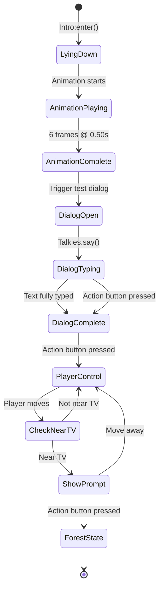

# Talkies Dialog System Integration Plan

## Overview
Integrate the Talkies dialog library into [`states/intro.lua`](../states/intro.lua) to display a basic test dialog box, confirming successful integration.

## Current Architecture Context

### Relevant Files
- **[`lib/talkies.lua`](../lib/talkies.lua)** - Dialog system library (recently added)
- **[`states/intro.lua`](../states/intro.lua)** - Intro stage where dialog will be added
- **[`game.lua`](../game.lua)** - Shared game context with font resources
- **[`main.lua`](../main.lua)** - Main game loop with virtual canvas rendering

### Key Architecture Points
1. **Virtual Canvas**: Game uses 640×360 virtual resolution with letterbox scaling
2. **State Management**: Uses hump.gamestate for state lifecycle
3. **Input System**: Baton library handles keyboard + gamepad input
4. **Font System**: RasterForgeRegular font loaded in `game.font` (100pt size)

### Intro State Flow
```
Intro:enter() → isLyingDown = true
    ↓
Lying down animation plays (6 frames @ 0.50s)
    ↓
Animation completes → isLyingDown = false
    ↓
Player gains control → can move and interact with TV
    ↓
Near TV + action button → Switch to Forest state
```

## Talkies Library API

### Core Functions
- **`Talkies.say(title, messages, config)`** - Queue a dialog
  - `title`: String for speaker name
  - `messages`: String or table of strings
  - `config`: Optional table with styling/callbacks
  
- **`Talkies.update(dt)`** - Update dialog animation/typing
- **`Talkies.draw()`** - Render current dialog
- **`Talkies.onAction()`** - Advance dialog or finish typing
- **`Talkies.isOpen()`** - Check if dialog is active
- **`Talkies.clearMessages()`** - Clear all queued dialogs

### Configuration Options
```lua
Talkies.font = love.graphics.newFont()  -- Default font
Talkies.textSpeed = 1/60                -- Characters per second
Talkies.messageColor = {1, 1, 1}        -- White text
Talkies.messageBackgroundColor = {0, 0, 0, 0.8}  -- Semi-transparent black
Talkies.padding = 10                    -- Box padding
```

## Integration Strategy

### 1. Library Import
Add Talkies require at the top of [`states/intro.lua`](../states/intro.lua):
```lua
local Talkies = require("lib.talkies")
```

### 2. Configuration Setup
In [`Intro:enter()`](../states/intro.lua:37), configure Talkies after loading assets:
```lua
-- Configure Talkies for this state
Talkies.font = game.font
Talkies.textSpeed = "medium"  -- or 0.04
Talkies.messageColor = {1, 1, 1}
Talkies.messageBackgroundColor = {0, 0, 0, 0.8}
Talkies.padding = 10
```

**Rationale**: Use the existing `game.font` for consistency with UI elements.

### 3. Test Dialog Trigger
Add dialog trigger after lying down animation completes in [`Intro:update()`](../states/intro.lua:71):
```lua
if isLyingDown then
    lyingAnim:update(dt)
    if lyingAnim.status == "paused" then 
        isLyingDown = false
        -- Trigger test dialog
        Talkies.say("System", "Talkies integration successful! Press action to continue.")
    end
```

**Rationale**: This provides immediate visual feedback that Talkies is working right after the intro animation.

### 4. Update Loop Integration
In [`Intro:update()`](../states/intro.lua:71), add Talkies update call:
```lua
function Intro:update(dt)
    input:update()
    
    -- Update Talkies first
    Talkies.update(dt)
    
    if isLyingDown then
        -- existing lying down logic
    else
        -- Only update player if dialog is not open
        if not Talkies.isOpen() then
            player:update(dt)
            promptAnim:update(dt)
            
            if nearTv() and (input:pressed("action") or input:pressed("jump")) then
                Gamestate.switch(require("states.forest"))
            end
        end
    end
end
```

**Rationale**: Prevent player movement while dialog is active to avoid conflicts.

### 5. Input Handling
Add input handling for dialog advancement in [`Intro:update()`](../states/intro.lua:71):
```lua
-- Handle dialog input
if Talkies.isOpen() then
    if input:pressed("action") or input:pressed("jump") then
        Talkies.onAction()
    end
end
```

**Rationale**: Reuse existing action/jump buttons for dialog interaction.

### 6. Render Integration
In [`Intro:draw()`](../states/intro.lua:87), add Talkies draw call at the end:
```lua
function Intro:draw()
    map:draw()
    
    if isLyingDown then
        -- existing lying down rendering
    else
        player:draw()
        
        if nearTv() and tvObj then
            -- existing prompt rendering
        end
    end
    
    -- Draw dialog on top of everything
    Talkies.draw()
end
```

**Rationale**: Dialog should render last to appear on top of all game elements.

## Implementation Details

### Virtual Canvas Compatibility
Talkies automatically detects canvas dimensions via `love.graphics.getCanvas()` and `getDimensions()`. Since [`main.lua`](../main.lua:39) sets the canvas before calling `Gamestate.draw()`, Talkies will correctly use the 640×360 virtual resolution.

### Font Scaling Considerations
The `game.font` is 100pt, which may be too large for dialog text. Consider these options:

**Option A**: Use existing font (simple, consistent)
```lua
Talkies.font = game.font
```

**Option B**: Create smaller font for dialogs (better readability)
```lua
local dialogFont = love.graphics.newFont("assets/fonts/RasterForgeRegular-JpBgm.ttf", 16)
dialogFont:setFilter("nearest", "nearest")
Talkies.font = dialogFont
```

**Recommendation**: Start with Option A for testing, switch to Option B if text is too large.

### Input Conflict Prevention
The current code checks `input:pressed("action")` for both:
1. TV interaction (line 81)
2. Dialog advancement (new)

**Solution**: Check `Talkies.isOpen()` before processing TV interaction to prevent simultaneous triggers.

### State Cleanup
Add cleanup in [`Intro:leave()`](../states/intro.lua) (if it exists) or create it:
```lua
function Intro:leave()
    Talkies.clearMessages()
end
```

**Rationale**: Prevent dialogs from carrying over to other states.

## Testing Checklist

After implementation, verify:
- [ ] Dialog box appears after lying down animation
- [ ] Text types out character by character
- [ ] Action button advances/completes typing
- [ ] Action button closes dialog when complete
- [ ] Player cannot move while dialog is open
- [ ] TV interaction still works after dialog closes
- [ ] Dialog renders within virtual canvas bounds
- [ ] Text is readable (not too large/small)

## Potential Issues & Solutions

### Issue 1: Font Too Large
**Symptom**: Dialog text overflows or looks oversized
**Solution**: Create smaller font instance (16-24pt range)

### Issue 2: Dialog Blocks Input Permanently
**Symptom**: Player can't move after dialog closes
**Solution**: Verify `Talkies.isOpen()` returns false after dialog completes

### Issue 3: Dialog Appears Behind Game Elements
**Symptom**: Dialog is obscured by map or player
**Solution**: Ensure `Talkies.draw()` is called last in `Intro:draw()`

### Issue 4: Multiple Dialogs Queue Unexpectedly
**Symptom**: Dialog triggers multiple times
**Solution**: Add flag to prevent re-triggering (e.g., `dialogShown` boolean)

## Future Enhancements

Once basic integration is confirmed:
1. Add character portraits using `config.image` parameter
2. Create dialog for TV interaction before state switch
3. Add sound effects using `config.talkSound`
4. Implement dialog options for branching conversations
5. Create reusable dialog configuration in [`game.lua`](../game.lua)

## File Modifications Summary

### [`states/intro.lua`](../states/intro.lua)
- **Line 1-9**: Add `local Talkies = require("lib.talkies")` after other requires
- **Line 37-69**: Add Talkies configuration in `Intro:enter()`
- **Line 71-85**: Modify `Intro:update()` to integrate Talkies update and input
- **Line 87-104**: Modify `Intro:draw()` to add `Talkies.draw()` at end
- **New**: Add `Intro:leave()` function for cleanup

**Total Changes**: ~15-20 lines of code additions/modifications

## Mermaid Diagram: Updated Intro State Flow



## Conclusion

This integration provides a minimal, testable implementation of Talkies in the intro stage. The approach:
- Maintains existing architecture patterns
- Prevents input conflicts
- Provides immediate visual confirmation
- Sets foundation for future dialog features

Once confirmed working, the same pattern can be applied to other states like [`states/forest.lua`](../states/forest.lua) for NPC conversations.
